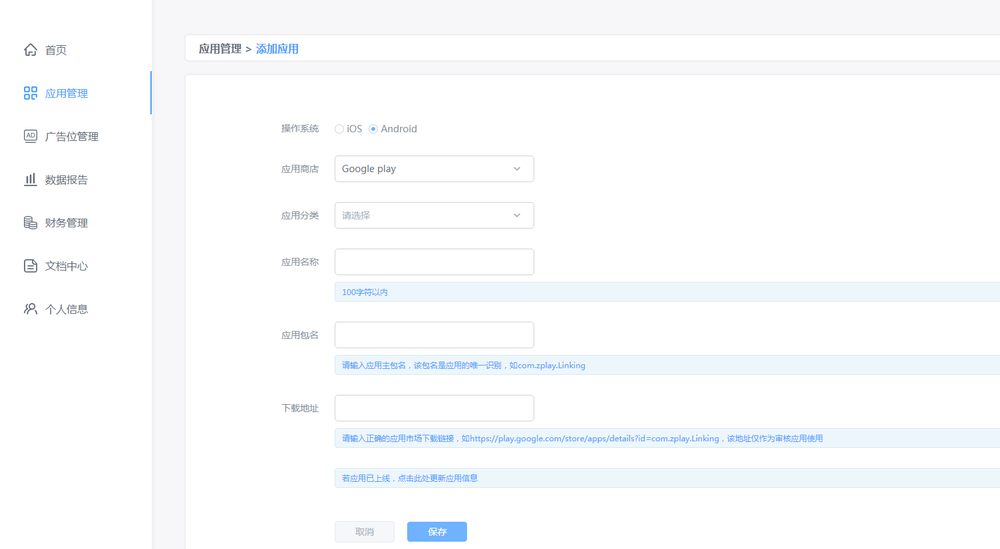
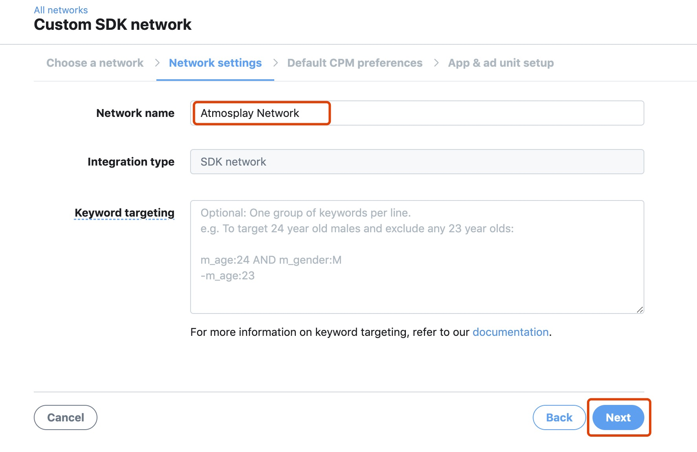
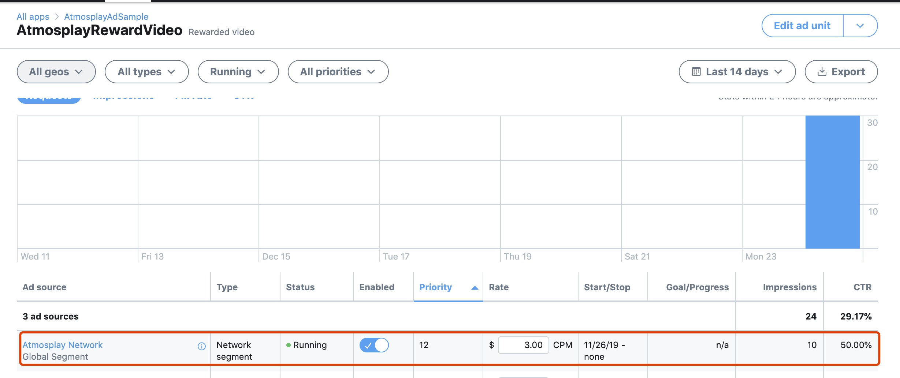

# 目录

   * [目录](#目录)
      * [1. 在可玩广告平台申请应用ID及广告位ID](#1-在可玩广告平台申请应用id及广告位id)
         * [1.1 进入“<a href="https://sellers.zplayads.com/#/app/appList/" rel="nofollow">应用管理</a>”页面，点击添加“添加应用”按钮](#11-进入应用管理页面点击添加添加应用按钮)
         * [1.2 填写相关信息，点击“保存”按钮，返回应用管理列表页](#12-填写相关信息点击保存按钮返回应用管理列表页)
         * [1.3 在应用管理列表页，获取应用的ID](#13-在应用管理列表页获取应用的id)
         * [1.4 点击应用右侧的“创建广告位”按钮或者进入“<a href="https://sellers.zplayads.com/#/ad/placeList/" rel="nofollow">广告位管理页面</a>”点击“添加广告位”按钮](#14-点击应用右侧的创建广告位按钮或者进入广告位管理页面点击添加广告位按钮)
         * [1.5填写相关信息，点击“保存”按钮，返回广告位管理列表页](#15填写相关信息点击保存按钮返回广告位管理列表页)
         * [1.6在广告位管理列表页，获取广告位的ID](#16在广告位管理列表页获取广告位的id)
      * [2. 添加MoPub SDK和Atmosplay Ads SDK，步骤如下：](#2-添加mopub-sdk和atmosplay-ads-sdk步骤如下)
         * [2.1 添加Android工程依赖](#21-添加android工程依赖)
         * [2.2 在Manifest文件下添加MoPub使用到的组件](#22-在manifest文件下添加mopub使用到的组件)
         * [2.3 在Manifest文件下添加下面的权限](#23-在Manifest文件下添加下面的权限)
      * [3. 添加适配器文件](#3-添加适配器文件)
      * [4. 在<a href="https://app.mopub.com/apps" rel="nofollow">MoPub平台</a>为可玩广告配置广告位](#4-在mopub平台为可玩广告配置广告位)
         * [4.1 为可玩广告新建广告位](#41-为可玩广告新建广告位)
         * [4.2 获取已有广告位的ID](#42-获取已有广告位的id)
      * [5. 在<a href="https://app.mopub.com/networks" rel="nofollow">MoPub平台</a>增加可玩广告为新的广告源](#5-在mopub平台增加可玩广告为新的广告源)
         * [5.1 进入“Networks”页面，点击“New network”按钮](#51-进入networks页面点击new-network按钮)
         * [5.2 点击“Custom SDK network“链接](#52-点击custom-sdk-network链接)
         * [5.3 填写 network name，例如Atmosplay Ads Network](#53-填写-network-name例如atmosplay-ads-network)
         * [5.4 填写 Custom event class 以及 Custom event class data](#54-填写-custom-event-class-以及-custom-event-class-data)
      * [6. 在<a href="https://app.mopub.com/segments" rel="nofollow">MoPub平台</a>打开可玩广告广告源](#6-在mopub平台打开可玩广告广告源)
         * [6.1 进入“segments”页面，点击“Global Segment”链接](#61-进入segments页面点击global-segment链接)
         * [6.2 找到接入可玩广告的应用（如示例中MediationMopub）及广告位（示例中的新可玩广告），打开可玩广告广告源（图中的turn on所示的按钮）](#62-找到接入可玩广告的应用如示例中mediationmopub及广告位示例中的新可玩广告打开可玩广告广告源图中的turn-on所示的按钮)
      * [7. 确认可玩广告配置成功](#7-确认可玩广告配置成功)
      * [8. 在工程中使用MoPub请求可玩广告](#8-在工程中使用mopub请求可玩广告)
      * [9. 测试](#9-测试)


## 1. 在可玩广告平台申请应用ID及广告位ID

### 1.1 进入“[应用管理](https://sellers.zplayads.com/#/app/appList/)”页面，点击添加“添加应用”按钮


### 1.2 填写相关信息，点击“保存”按钮，返回应用管理列表页

a. 若您的应用已上线，且为Google Play渠道的应用，可直接填入应用包名获取应用信息


b. 若您未在Google Play上线，或发布在非Google Play渠道，您需手动填写应用信息


### 1.3 在应用管理列表页，获取应用的ID


### 1.4 点击应用右侧的“创建广告位”按钮或者进入“[广告位管理页面](https://sellers.zplayads.com/#/ad/placeList/)”点击“添加广告位”按钮


### 1.5填写相关信息，点击“保存”按钮，返回广告位管理列表页


### 1.6在广告位管理列表页，获取广告位的ID


## 2. 添加MoPub SDK和Atmosplay Ads SDK，步骤如下：

```java
dependencies {
    ...
    // 可玩广告依赖
    implementation 'com.atmosplayads:atmosplayads:3.0.0'
    // mopub广告依赖
    implementation('com.mopub:mopub-sdk:5.6.0@aar') {
        transitive = true
    }
}
```

### 2.1 添加Android工程依赖

### 2.2 在Manifest文件下添加MoPub使用到的组件

```java
<application>
    <activity
        android:name="com.mopub.mobileads.MoPubActivity"
        android:configChanges="keyboardHidden|orientation|screenSize" />
    <activity
        android:name="com.mopub.mobileads.MraidActivity"
        android:configChanges="keyboardHidden|orientation|screenSize" />
    <activity
        android:name="com.mopub.common.MoPubBrowser"
        android:configChanges="keyboardHidden|orientation|screenSize" />
    <activity
        android:name="com.mopub.mobileads.MraidVideoPlayerActivity"
        android:configChanges="keyboardHidden|orientation|screenSize" />
    <activity
        android:name="com.mopub.mobileads.RewardedMraidActivity"
        android:configChanges="keyboardHidden|orientation|screenSize" />
</application>
```

### 2.3 在Manifest文件下添加下面的权限
```xml
<!-- 国内渠道必须添加，GooglePlay可以不添加 -->
<uses-permission android:name="android.permission.READ_PHONE_STATE" />
```

## 3. 添加适配器文件
1. Banner适配器及位置：[AtmosplayAdsBanner.java](./mopubadapter/src/main/java/com/atmosplayads/mopubadapter/AtmosplayAdsBanner.java)

2. 激励视频适配器及位置：[AtmosplayAdsRewardedVideo.java](./mopubadapter/src/main/java/com/atmosplayads/mopubadapter/AtmosplayAdsRewardedVideo.java)

3. 插屏适配器及位置：[AtmosplayAdsInterstitial.java](./mopubadapter/src/main/java/com/atmosplayads/mopubadapter/AtmosplayAdsInterstitial.java)

4. 工具类(包含解析 mopub 后台配置的信息，转换错误码等功能)：[AtmosplayAdsUtils.java](./mopubadapter/src/main/java/com/atmosplayads/mopubadapter/AtmosplayAdsUtils.java)


确保导入相关的类之后没有错误提示，记录该文件包路径，例如：（com.atmosplayads.mopubadapter.AtmosplayAdsRewardedVideo），这个路径用于在MoPub平台配置Atmosplay Network信息。

文档整体以激励视频为例，插屏和Banner配置过程与激励视频相似。

## 4. 在[MoPub平台](https://app.mopub.com/apps)为可玩广告配置广告位

### 4.1 为可玩广告新建广告位

- a. 进入应用，点击“New ad unit”按钮


- b. 创建广告位，请注意Format应该为Banner, Rewarded video或Fullscreen，点击“save”按钮，此处以Rewarded video为例

 

- c. 获取新创建广告位的ad unit ID


### 4.2 获取已有广告位的ID

- a. 选择应用，进入广告位列表，选择要接入的广告位，点击进入。点击“Edit ad unit”按钮，点击“view code integration”按钮


- b. 获取广告位的ad unit ID


## 5. 在[MoPub平台](https://app.mopub.com/networks)增加可玩广告为新的广告源

### 5.1 进入“Networks”页面，点击“New network”按钮


### 5.2 点击“Custom SDK network“链接


### 5.3 填写 network name，例如Atmosplay Network




### 5.4 填写 Custom event class 以及 Custom event class data

- Banner:
	- custom event class 应该为 `com.atmosplayads.mopubadapter.AtmosplayAdsBanner`
	- custom event class data 应该为
		`{"appId":"5C5419C7-A2DE-88BC-A311-C3E7A646F6AF","unitId":"F22F347B-3D57-0C70-0B13-EFCFDF402EBA"}`

- RewardedVideo:
	- custom event class 应该为 `com.atmosplayads.mopubadapter.AtmosplayAdsRewardedVideo`
	- custom event class data 应该为
		`{"appId":"5C5419C7-A2DE-88BC-A311-C3E7A646F6AF","unitId":"F22F347B-3D57-0C70-0B13-EFCFDF402EBA"}`

- Interstitial:
	- custom event class 应该为 `com.atmosplayads.mopubadapter.AtmosplayAdsInterstitial`
	- custom event class data 应该为
    `{"appId":"5C5419C7-A2DE-88BC-A311-C3E7A646F6AF","unitId":"19393189-C4EB-3886-60B9-13B39407064E"}`

注意：将5C5419C7-A2DE-88BC-A311-C3E7A646F6AF替换成您在可玩广告平台申请的APPID（步骤1.3），将3FBEFA05-3A8B-2122-24C7-A87D0BC9FEEC替换成您在可玩广告平台申请的AdUnitId（步骤1.6）。

## 6. 在[MoPub平台](https://app.mopub.com/segments)打开可玩广告广告源

### 6.1 进入“segments”页面，点击“Global Segment”链接


### 6.2 找到接入可玩广告的应用（如示例中MediationMopub）及广告位（示例中的新可玩广告），打开可玩广告广告源（图中的turn on所示的按钮）


## 7. 确认可玩广告配置成功

进入6.2 中已经打开可玩广告源的广告位管理页面，如果成功配置，则会在ad sources列表中会显示如下信息。如果未显示，请参照以上步骤进行检查。



## 8. 在工程中使用MoPub请求可玩广告

详情参考Demo示例，示例中各文件作用如下：

[MainActivity](./app/src/main/java/com/atmosplayads/mediationmopub/MainActivity.java)中有mopub初始化设置，可以参考[mopub文档](https://developers.mopub.com/docs/android/initialization/)进行设置

[BannerActivity](./app/src/main/java/com/atmosplayads/mediationmopub/BannerActivity.java)是Banner示例，在文件中填写在mopub平台上申请的Banner广告位id，并配置好[可玩Banner适配器](./mopubadapter/src/main/java/com/atmosplayads/mopubadapter/AtmosplayAdsBanner.java)AtmosplayAds Banner广告。

[RewardedVideoActivity](./app/src/main/java/com/atmosplayads/mediationmopub/RewardedVideoActivity.java)是激励视频示例，在文件中填写在mopub平台上申请的激励视频广告位id，并配置好[可玩视频适配器](./mopubadapter/src/main/java/com/atmosplayads/mopubadapter/AtmosplayAdsRewardedVideo.java)，就可以通过mopub获取到AtmosplayAds激励视频广告。

[InterstitialActivity](./app/src/main/java/com/atmosplayads/mediationmopub/InterstitialActivity.java)是插屏广告示例，在文件中填写在mopub平台申请的插屏广告位id，并配置好[可玩插屏适配器](./mopubadapter/src/main/java/com/atmosplayads/mopubadapter/AtmosplayAdsInterstitial.java)，就可以通过mopub获取到AtmosplayAds插屏广告。

## 9. 测试
您在测试中可使用如下ID进行测试，测试ID不会产生收益，应用上线时请使用您申请的正式ID。

|广告形式|  App_ID  |  Ad_Unit_ID|
|---|----------|------------|
|Banner|5C5419C7-A2DE-88BC-A311-C3E7A646F6AF|F22F347B-3D57-0C70-0B13-EFCFDF402EBA|
|激励视频|5C5419C7-A2DE-88BC-A311-C3E7A646F6AF|3FBEFA05-3A8B-2122-24C7-A87D0BC9FEEC|
|插屏广告|5C5419C7-A2DE-88BC-A311-C3E7A646F6AF|19393189-C4EB-3886-60B9-13B39407064E|
