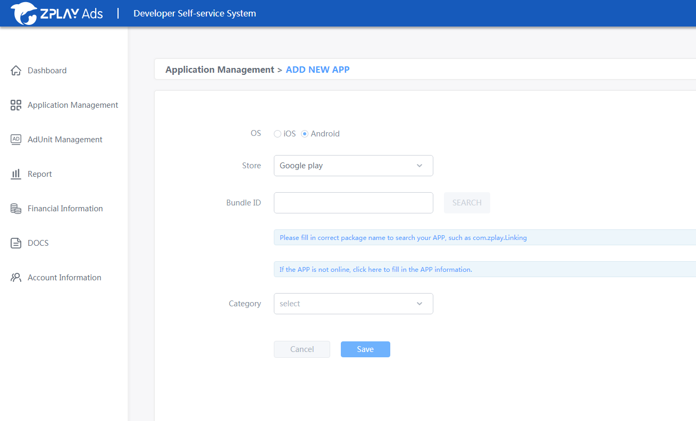
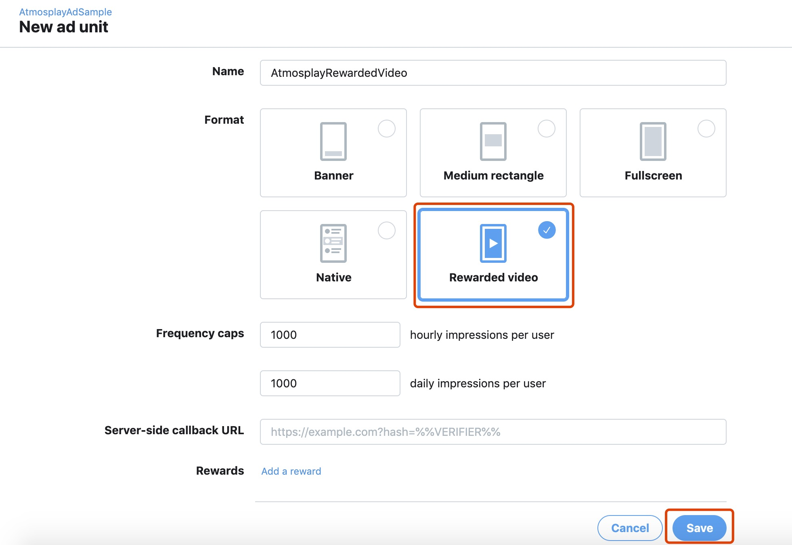
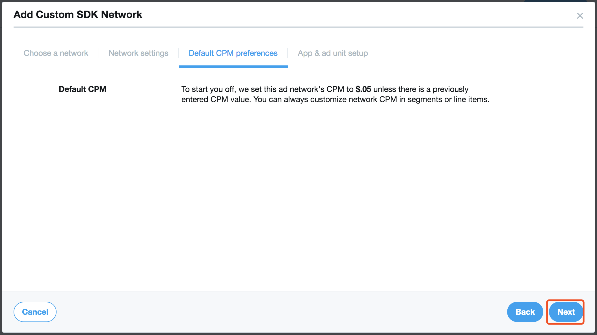

# Directory

   * [Directory](#directory)
      * [1. Apply for APP ID and Ad Unit ID on Atmosplay Ads platform](#1-apply-for-app-id-and-ad-unit-id-on-atmosplay-ads-platform)
         * [1.1 Click <em>ADD NEW APP</em> button in <a href="https://sellers.zplayads.com/#/app/appList/" rel="nofollow">Application Management</a> page](#11-click-add-new-app-button-in-application-management-page)
         * [1.2 Fill in app information, and click <em>Save</em> button, then go back to Application Management](#12-fill-in-app-information-and-click-save-button-then-go-back-to-application-management)
         * [1.3 Obtain your APP ID in Application Management page](#13-obtain-your-app-id-in-application-management-page)
         * [1.4 Click <em>ADD NEW ADUNIT</em> button in app list, or you are also available to do this in <a href="https://sellers.zplayads.com/#/ad/placeList/" rel="nofollow">AdUnit Management</a> page](#14-click-add-new-adunit-button-in-app-list-or-you-are-also-available-to-do-this-in-adunit-management-page)
         * [1.5 Fill in adunit information, and click <em>Save</em> button, then go back to AdUnit Management](#15-fill-in-adunit-information-and-click-save-button-then-go-back-to-adunit-management)
         * [1.6 Obtain your adunit ID in AdUnit Management page](#16-obtain-your-adunit-id-in-adunit-management-page)
      * [2. Add MoPub SDK and Atmosplay Ads SDK as below](#2-add-mopub-sdk-and-atmosplay-ads-sdk-as-below)
         * [2.1 Add android project dependency](#21-add-android-project-dependency)
         * [2.2 Add MoPub-used components in Manifest file](#22-add-mopub-used-components-in-manifest-file)
      * [3. Add the following files into project](#3-add-the-following-files-into-project)
      * [4. Set up ad unit for Atmosplay Ads on <a href="https://app.mopub.com/apps" rel="nofollow">MoPub</a>](#4-set-up-ad-unit-for-atmosplay-ads-on-mopub)
         * [4.1 Create new adunit for Atmosplay Ads](#41-create-new-adunit-for-atmosplay-ads)
         * [4.2 Obtain the existed adunit ID](#42-obtain-the-existed-adunit-id)
      * [5. Add Atmosplay Ads as a new network on <a href="https://app.mopub.com/networks" rel="nofollow">MoPub</a>](#5-add-atmosplay-ads-as-a-new-network-on-mopub)
         * [5.1 Open Networks page, click <em>New network</em> button](#51-open-networks-page-click-new-network-button)
         * [5.2 Click <em>Custom SDK Network</em> link](#52-click-custom-sdk-network-link)
         * [5.3 Enter the network name，like Atmosplay Ads Network](#53-enter-the-network-namelike-atmosplay-ads-network)
         * [5.4 Enter Custom event class and Custom event class data](#54-enter-custom-event-class-and-custom-event-class-data)
      * [6. Turn on Atmosplay Ads network on <a href="https://app.mopub.com/segments" rel="nofollow">MoPub</a>](#6-turn-on-atmosplay-ads-network-on-mopub)
         * [6.1 Open Segments page, and click Global Segment](#61-open-segments-page-and-click-global-segment)
         * [6.2 Find the app and adunit which have been integrated to Atmosplay Ads（as the MediationMopub in screenshot below), turn on Atmosplay Ads network(as the turn on button in screenshot below)](#62-find-the-app-and-adunit-which-have-been-integrated-to-atmosplay-adsas-the-mediationmopub-in-screenshot-below-turn-on-atmosplay-ads-networkas-the-turn-on-button-in-screenshot-below)
      * [7. Confirm the configuration of Atmosplay Ads](#7-confirm-the-configuration-of-atmosplay-ads)
      * [8. Use MoPub to request Atmosplay Ads in project](#8-use-mopub-to-request-atmosplay-ads-in-project)
      * [9. Test](#9-test)


## 1. Apply for APP ID and Ad Unit ID on Atmosplay Ads platform

### 1.1 Click *ADD NEW APP* button in [Application Management](https://sellers.zplayads.com/#/app/appList/) page


### 1.2 Fill in app information, and click *Save* button, then go back to Application Management

a. If your APP is launched in Google Play, you can fill in package name to get APP information


b. If your APP has not launched in Google Play, or launched in non Google Play store, you should fill in APP information manually


### 1.3 Obtain your APP ID in Application Management page


### 1.4 Click *ADD NEW ADUNIT* button in app list, or you are also available to do this in [AdUnit Management](https://sellers.zplayads.com/#/ad/placeList/) page


### 1.5 Fill in adunit information, and click *Save* button, then go back to AdUnit Management


### 1.6 Obtain your adunit ID in AdUnit Management page


## 2. Add MoPub SDK and Atmosplay Ads SDK as below

### 2.1 Add android project dependency

```java
dependencies {
    ...
    // Atmosplay Ads dependency
    implementation 'com.atmosplayads:atmosplayads:3.0.0'
    // Mopub dependency
    implementation('com.mopub:mopub-sdk:5.6.0@aar') {
        transitive = true
    }
}
```

### 2.2 Add MoPub-used components in Manifest file

```java
<application>
    <activity
        android:name="com.mopub.mobileads.MoPubActivity"
        android:configChanges="keyboardHidden|orientation|screenSize" />
    <activity
        android:name="com.mopub.mobileads.MraidActivity"
        android:configChanges="keyboardHidden|orientation|screenSize" />
    <activity
        android:name="com.mopub.common.MoPubBrowser"
        android:configChanges="keyboardHidden|orientation|screenSize" />
    <activity
        android:name="com.mopub.mobileads.MraidVideoPlayerActivity"
        android:configChanges="keyboardHidden|orientation|screenSize" />
    <activity
        android:name="com.mopub.mobileads.RewardedMraidActivity"
        android:configChanges="keyboardHidden|orientation|screenSize" />
</application>
```

## 3. Add the following files into project
1. Banner adapter: [AtmosplayAdsBanner.java](./mopubadapter/src/main/java/com/atmosplayads/mopubadapter/AtmosplayAdsBanner.java)

2. Reward video adapter: [AtmosplayAdsRewardedVideo.java](./mopubadapter/src/main/java/com/atmosplayads/mopubadapter/AtmosplayAdsRewardedVideo.java)

3. Interstitial adapter: [AtmosplayAdsInterstitial.java](./mopubadapter/src/main/java/com/atmosplayads/mopubadapter/AtmosplayAdsInterstitial.java)

4. Util Class(which contains some common methods, such as parsing the json issued by Mopub, or converting the error code)：[AtmosplayAdsUtils.java](./admobadapter/src/main/java/com/atmosplayads/admobadapter/AtmosplayAdsUtils.java)


Please ensure no errors after classes imported. Then record the path of package, e.g (com.atmosplayads.mopubadapter.AtmosplayAdsRewardedVideo) which is used to configure AtmosplayAds on MoPub.

This document only shows how to configure RewardVideo adapter, you can configure the interstitial adapter and Banner adapter by the same way.

## 4. Set up ad unit for Atmosplay Ads on [MoPub](https://app.mopub.com/apps)

### 4.1 Create new adunit for Atmosplay Ads

- a. Choose your app, click *New ad unit* button


- b. Choose Rewarded video or Fullscreen when creating adunit, then click *Save* button, take Rewarded video as an example here



- c. Obtain the new adunit ID


### 4.2 Obtain the existed adunit ID

- a. Choose your APP and enter adunit list. Click the adunit, and click *Edit an unit*, then choose *View code integration* button.


- b. Obtain the adunit ID


## 5. Add Atmosplay Ads Network on [MoPub](https://app.mopub.com/networks)

### 5.1 Open Networks page, click *New network* button


### 5.2 Click *Custom SDK Network* link


### 5.3 Enter the network name，like Atmosplay Ads Network




### 5.4 Enter Custom event class and Custom event class data

- for Banner:
	- custom event class should be `com.atmosplayads.mopubadapter.AtmosplayAdsBanner`
	- custom event class data should be
		`{"appId":"5C5419C7-A2DE-88BC-A311-C3E7A646F6AF","unitId":"F22F347B-3D57-0C70-0B13-EFCFDF402EBA"}`

- for RewardedVideo:
	- custom event class should be `com.atmosplayads.mopubadapter.AtmosplayAdsRewardedVideo`
	- custom event class data should be
    `{"appId":"5C5419C7-A2DE-88BC-A311-C3E7A646F6AF","unitId":"F22F347B-3D57-0C70-0B13-EFCFDF402EBA"}`

- for Interstitial:
	- custom event class should be `com.atmosplayads.mopubadapter.AtmosplayAdsInterstitial`
	- custom event class data should be
		`{"appId":"5C5419C7-A2DE-88BC-A311-C3E7A646F6AF","unitId":"19393189-C4EB-3886-60B9-13B39407064E"}`

> Note: Please remember to change test APP ID "5C5419C7-A2DE-88BC-A311-C3E7A646F6AF" to the APP ID you applied on Atmosplay Ads Platform, and change test Ad Unit ID "3FBEFA05-3A8B-2122-24C7-A87D0BC9FEEC" to the Ad Unit ID you applied on Atmosplay Ads Platform.


## 6. Turn on Atmosplay Ads network on [MoPub](https://app.mopub.com/segments)

### 6.1 Open Segments page, and click Global Segment


### 6.2 Find the app and adunit which have been integrated to Atmosplay Ads（as the MediationMopub in screenshot below), turn on Atmosplay Ads network(as the turn on button in screenshot below)


## 7. Confirm the configuration of Atmosplay Ads

After step 6.2, the Atmosplay Ads network has been available already. Enter AdUnit Management page, the ad sources list will be shown as below if configuration is successful. If not, please check the setting according to the previous steps.


## 8. Use MoPub to request Atmosplay Ads in project

You can get more code samples from Atmosplay Ads Demo. The main files work as follows:

As for [MainActivity](./app/src/main/java/com/atmosplayads/mediationmopub/MainActivity.java), you can learn how to initialize mopub sdk as the mopub's [document](https://developers.mopub.com/docs/android/initialization/) said.

[RewardedVideoActivity](./app/src/main/java/com/atmosplayads/mediationmopub/RewardedVideoActivity.java) is a rewarded video sample code. When you get your mopub an unitID, and make sure the [adapter](./mopubadapter/src/main/java/com/atmosplayads/mopubadapter/AtmosplayAdsRewardedVideo.java) in your project, you will get rewarded video from Atmosplay Ads.

## 9. Test
You are available to use the following ID when testing(not charge). Please switch to the ID you applied in production mode.

| OS      | Ad_Type        | App_ID                               | Ad_Unit_id                           |
| ------- | -------------- | ------------------------------------ | ------------------------------------ |
| Android |Banner|5C5419C7-A2DE-88BC-A311-C3E7A646F6AF|F22F347B-3D57-0C70-0B13-EFCFDF402EBA|
| Android | Rewarded video | 5C5419C7-A2DE-88BC-A311-C3E7A646F6AF | 3FBEFA05-3A8B-2122-24C7-A87D0BC9FEEC |
| Android | Interstitial   | 5C5419C7-A2DE-88BC-A311-C3E7A646F6AF | 19393189-C4EB-3886-60B9-13B39407064E |
